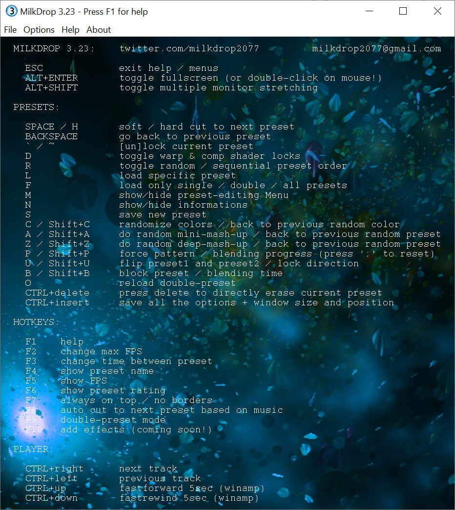

# MilkDrop3

MilkDrop 3.0 is a portable program that supports any audio source (Spotify, YouTube, SoundCloud...) 
it's an evolution of my version of BeatDrop2077, based on BeatDrop. 
It supports a new type of double-preset (.milk2 file) mixing 2 presets and displaying them both simultaneously. 
Here are a few double-preset: https://www.youtube.com/watch?v=97XrIatMBWc 
You can create new presets by pressing just a few keys without knowing any lines of code 
(F9 and then press the spacebar to create a new double-preset, that's it) and create new colors by pressing just the key 'c'. 
Also I created a new mode for auto-changing the presets based on beat detection. 
Here is a fast version of that: https://www.youtube.com/watch?v=pSzdThg1iW8 
 

-Lots of new key shortcuts, see the whole list above. 
For some letters, the majuscule and minuscule matters. 
As an example, I'm using the lower-case "a" for the classic random mini-mash-up and 
upper-case "A" (shift+a) for another function: back to previous random preset. 

-Support always on top window (F7) 

-Support multiple monitor stretching (ALT+SHIFT) thanks to milkdropper for the code. 

-Real-time toggling FPS (F2) 60fps, 90fps, 120fps ect... (some presets may not work well on high fps) 

-Real-time toggling seconds between auto transition to next preset (F3) 15sec, 30sec, 45sec ect... 

-Support of displaying 16 shapes simultaneously instead of 4. 
Shapes are now exported with the '.shape' file extension in Milkdrop3\shapes\file.shape 

-Support of displaying 16 waves simultaneously instead of 4. 
Waves are now exported with the '.wave' file extension in Milkdrop3\waves\file.wave 

-8 new simple waveform (total of 16) 

-The q1-q32 variables have been expanded; the range is now q1-q64. 

-Support going back to previous generated preset when pressing the key 'A' (Shift+a) 
I've waited 20 years for that function! 

-Support deep-mash-up, not just warp and comp mashup, but all 5 bins (z) 
note: this is quite unstable, some presets will crash MilkDrop3. But the results can be really great. 

-Support going back to previous generated preset when pressing the key 'Z' (Shift+z) 

-Support randomize colors function, pressing the (c) key will change all the colors in the comp shader directly in the memory. 
Don't forget to save the preset if you like the new color. 

-Support going back to previous generated color when pressing the key 'C' (Shift+c) 

-Lots of new debug information pressing the letter 'n', very useful when you create new double-preset. 

-Support auto-changing the presets based on beat detection (F8) ex: https://twitter.com/MilkDrop2077/status/1617405613960560641 
hardcut1 : load a new preset if bass > 1.5 with a minimum delay of 0.2 sec 
hardcut2 : load a new preset if treb > 2.9 with a minimum delay of 0.5 sec 
hardcut3 : load a new preset if treb > 2.9 with a minimum delay of 1 sec 
hardcut4 : load a new preset if treb > 2.9 with a minimum delay of 3 sec but if treb > 8 then it will load a new preset 
hardcut5 : load a new preset if treb > 2.9 with a minimum delay of 5 sec 
hardcut6 : load a new preset if bass >1.5 + will load Bass/WHITE.milk if bass > 4.90 

-Lots of new transition effects (when pressing the spacebar), the first old 4 were : "zoom", "side", "plasma", "cercle", 
new ones: "plasma2", "plasma3", "snail", "snail2", "snail3", "triangle", "donuts", "corner", "patches", "checkerboard", "bubbles", "stars", "cisor", "wave",  "curtain", "vertical", "horizontal", "linesvertical", "lineshorizontal" 
A few example here: https://www.youtube.com/watch?v=WXK-pzCPfYk 

-Improved search function: 
now we can search for anything in the presets list, not just one letter. 
you can type 'mar' for martin's presets. 
you can even type 'kings' if you search for 'martin - kings cross' for example. 

-bunch of optimized function with chatgpt 

-PLAYER CONTROL: 
Pressing CTRL+right will load the next track (on any player, spotify, youtube if you're listening to a playlist of songs...) 
CTRL+left will load the previous track on any player 
CTRL+up will send a fastforward 5sec command to winamp only 
CTRL+down will send a fastrewind 5sec command to winamp only 

-Pressing the key 'f' will filter the presets : showing (and loading) only normal .milk presets, only double .milk2 presets or ALL of them. 
Keep in mind that if you want to mashup presets (with a/z/m) or create some new double-presets, 
you should be showing only classic presets (.milk), for that press 'f' twice. 

-double-preset (.milk2) https://www.youtube.com/watch?v=n37SbxfLK0k 
Press F9 to enter double-preset mode. Now if you press the spacebar, you'll create a mix of 2 presets. 
You can save them with the key 's' like a normal preset, it will create a new milk2 file. 
You can try a few blending effect by pressing spacebar and then backspace a few times, 
or you can force certain type of blending pattern pressing the key 'p' ("zoom", "side", "plasma" ect...) 
if you press the key 'P' you can force the blending progress (10%, 20%, 30% ect...) 
Some blending pattern like plasma have a lots of random values, 
so you'll have different results pressing the spacebar and backspace multiple times. 
All of these random values are saved in the .milk2 file. 
Again, if you want to create double-presets, I suggest loading only normal milk presets by pressing the 'f' key twice (show only classic-presets) 
Please take note that resizing the window or entering/exiting fullscreen mode will "break" your double-preset, 
MilkDrop will fully load the second preset of the double-preset displaying.  

Also: 
-WAVE_SIZE can now have 0-100 value 
-ZOOM_AMOUNT can now have 0-100 value 
-ZOOM_EXPONENT can now have 0-100 value 
-WARP_AMOUNT can now have 0-100 value 
-WARP_SCALE can now have 0-100 value 
-WARP_SPEED can now have 0-100 value 

I've setup up a patreon page, I've spend countless hours on MilkDrop3, if you would like to support this project and future updates: 
https://www.patreon.com/MilkDrop3  

History: 

-09/04/2023 : Version 3.12 :  
10x faster way to load the presets list, can load 50.000 presets under 1 second! 
better way to display preset's names (F4) for milk and milk2 files 
new plasma3 transition effect (a bit crazier than plasma and plasma2)  
corrected a few bugs while loading preset with textures 
I removed the V2M player in the installer to avoid any false-positive  
-19/03/2023 : Version 3.1 : stable  
-03/03/2023 : Version 3.0 : alpha, pretty unstable
